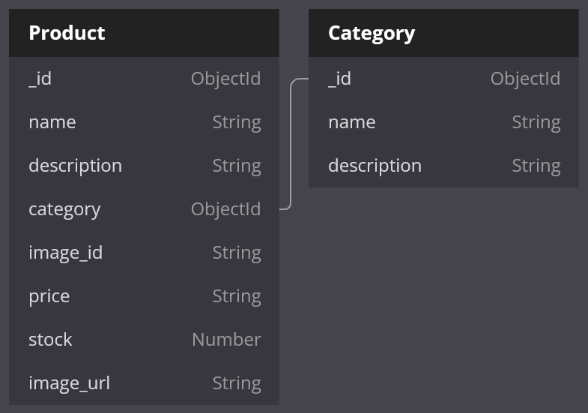

# Database

# Website routes

User Routes (available to everyone)
* `/` (home)
* `/shop`
* `/product/:product_name/:id`
* `/about`
* `/contact`

Admin Routes (available only to admins)
* `/admin/inventory` - inventory with a list of all products. From there you can also delete products.
* `/admin/product/create` - create new products
* `/admin/product/:id` - edit existing products
* `/admin/categories` - list all categories
* `/admin/category/create` - create new category
* `/admin/category/:id` - edit existing categories
  

# DETAILS
The website is built with Express. 

It is a simulation of an eCommerce, capable to manage an inventory and display the products available with all the relative information.

The main scope of building this website was learning Express Js, so the website will not be perfect on the front-end side.

## How things work generally
From `app.js` we import the routers, then the routers will assign a controller action to each route.

After that, when we visit a route our request is handled by the controller that will process all the data necessary then it wil render the page we want to see.

All the pages are stored inside `views`. 
In this project I used a layout and I installed the package `express-ejs-layouts` for it.

## General notes
The website is divided into 2 parts: one for the user and one for the admins.

The users views are under `/views` while the admin views are under `/views/admin` and are displayed on the website under the namespace of `admin`.

The admin routes have their own router called `/routes/admin.js`, while the other routes use the standard `/routes/index.js`

The controllers are divided by categories (products, categories, general) and not by level of access.

Users can:
* View home
* View shop
* View products (no editing)

Admins can:
* View inventory
* Create new products
* Edit products
* Delete products
* View categories
* Edit categories
* Delete categories
* View every page of the website

For now everyone can access admin routes since there is no authentication system.

## Image saving process

Upload of files is handled by [multer](https://www.npmjs.com/package/multer).

After the form is submitted, the image is saved on the server storage and its name is available inside the POST request under `req.file.filename`.

The image is then uploaded to cloudinary (using as name the `image_id`) and deleted from our server local storage.

If for some reason the `POST` request to our server is not successfully submitted (es. invalid parameters), the image submitted will be saved then deleted immediately after to avoid clutter.

The same thing goes for the upload to cloudinary: if the request is not successfull, the image will be deleted from our server local storage.

If the image is successfully uploaded to cloudinary, the code will proceed.

If a product is deleted from the database, its associated image will also be deleted from Cloudinary.

# How product_create_post and product_update_post work
## product_create_post

Initially the values of the post request are sanitized using express-validator. 

After the inputs are sanitized we enter inside the request function. 

If the request detects that the anti_spam filter is not empty then nothing will happen. This behaviour is to protect the website against bots. The anti_spam is a form field that has `display: none` on it. A good intentioned user will not see it and leave it empty. A bot will see it and it will fill it.

After the anti_spam check, we declare the `errors` variable with the validation results, the we instantiate a `product` variable with the sanitized request values.

If `exress-validator` detects errors inside the values that are submitted, the page `/product/create` page will be rendered again, with the fields already compiled with the sanitized values (except the ones where there has been an error). In this process the image that was submitted gets saved locally, but it gets deleted because of the errors.

If the `express-validator` doesn't find any errors, the server proceeds to upload the product image to cloudinary. If there are any errors (detected by `results.error`) the page will be rendered again with the relative error messages and the locally stored image will be deleted.

if there are no errors in uploading the image to cloudinary, the locally stored image is deleted because the website does not need it anymore; to the `product` instance gets added the `image_url` provided as response to our request to cloudinary, and finally the `product` instance is saved to mongoDB.

## product_update_post

Initially the values of the post request are sanitized using express-validator. 

After the inputs are sanitized we enter inside the request function. 

If the request detects that the anti_spam filter is not empty then nothing will happen. This behaviour is to protect the website against bots. The anti_spam is a form field that has `display: none` on it. A good intentioned user will not see it and leave it empty. A bot will see it and it will fill it.

After the anti_spam check, we declare the `errors` variable with the validation results, the we instantiate a `product` variable with the sanitized request values.

This time `product` also has an `image_url` and an `_id`: this is because the product already exists, we are just updating it.

To instantiate the product 2 helper functions are used: `checkImgSubmit()` and `priceFormatter()`.
The first one checks if a new image has been submitted for the product: if true, it will return the new image id; if false, it will return the id of the image that was already stored in the database.
PriceFormatter just adds the decimals to the price (`.00`) in case the user did not add them.

If `exress-validator` detects errors inside the values that are submitted, the page will be rendered again, with the fields already compiled with the sanitized values (except the ones where there has been an error and the image). In this process, if the image that was submitted, it gets saved locally, but it gets deleted because of the errors.

If `express-validator` does not find any errors, we proceed to check if a new image was submitted.

If a new image was submitted, we upload it to cloudinary. If there are errors we re-render the page. If there are no errors, we add the new `image_url` provided in the response request from cloudinary and we add it to our `product` instance. We alaways delete the image stored in our server local storage in the moment we don't need it anymore.

If no new image is submitted, we just update the fields that got edited. The form will provide us with the old image_url as a secret field.

# How to run locally

After cloning the repository, execute `$ npm install` to install all the dependencies. 

Connect the app to your own MongoDb database by editing accordingly the `mongoDB` variable inside `app.js`.

You should also create a `.env` file and put inside of it `DBPASSWORD` with your mongodb database password and `CLOUDINARY_URL` with the config to connect to your cloudinary account.

Then execute `$ npm run serverstart` to start the server.

This will make the website accessible from your browser at `https://localhost:3000`.

---

# Live website link: [Fragrance Library](https://minis-fragrance-library.herokuapp.com/)

# Bad practices used
Putting all style in a single file is a bad practice because it sends a bunch of useless data, increasing load time on the website. Ideally it would be better to send (from the controller when rendering the page) the name of the stylesheet you want to use. This value would be handled by the `layout.ejs` since it is the view that handles the head for all the pages.
All styling is mashed into a single file because I was using a vscode extension that compiles my sass file into a `main.css` file, plus the scope of this project was not being a perfectionist on the front-end, but learning express js, so my efforts went to the back-end.

Another thing that was done wrong was sending 2 different containers for mobile and desktop views. This increased ofc the size of the data sent to the user, therefore increased loading times.
A better approach would have been to use `Adaptive web design` instead of `Responsive` web design and send to the end user only the layout for his specific device that was using to view the website.
This would, again, require too much effort on the design of things, and my focus for this project was to learn express js.
